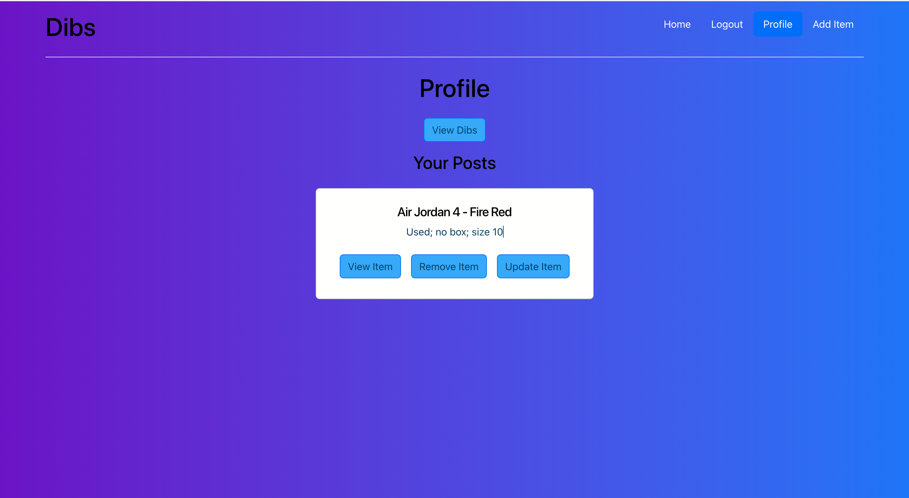

# Dibs
  
## Description
One person’s trash is another’s treasure -- but sometimes that treasure is hard to find.

Our app, DIBS, offers a platform where those trying to declutter their homes can give away their used items to those who really want it, and offers affordable options to consumers feeling the weight of inflation.
DIBS keeps usable items out of landfills, and finds people who will treasure them! 

  
## Authors
#### Chandler Davis - echandlerdavis@gmail.com
#### Nolan Flannery - nolanflannery@gmail.com
#### Chris Faust - cefaust82@gmail.com
#### Franky Erra - frankyerra1@gmail.com
#### Drew Payton - drewpayton18@gmail.com

## Live Page:
 [Dibs](https://the-real-dibs.herokuapp.com/) 

## Screenshot(s):

## Table of Contents
### [Technologies](#technologies)
### [Usage](#usage)
### [License](#license)

## Technologies
  - React
  - Bootstrap
  - CSS
  - JWT
  - Moment
  - NodeJS
    - Apollo
    - Bcrypt
    - Dotenv
    - Express
    - Jsonwebtoken
    - Mongoose
    - Graphql

## Usage
* ### Log-in / Sign-up 
* ### Home Page
  - This page will display all items posted by all users. You will have the option to view or call dibs on a specific items. The user can comment on the items posted on this page. Simply, click view item to post a comment

* ### Profile Page
  - This page will display all items the user has posted and all items the user has placed a dib on. Click on the button Dib or Post to toggle between either lists. The user can edit their posts or comment on a dibbed item from this page

* ### Add Item Page
  - This page will allow the user to post their item for others users to view and/or place a dib on

  
## License
This project is MIT Licensed
  

 